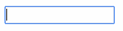

# This project supports Cool:GEN server frameworks. #


Here we review Angular components, directives, services and other classes from 
**@adv-appmod/bphx-cool** library. Directives introduced usually use **cool**
prefix. 

Please note that some directives don’t have visual
presentation in output HTML page, the other are markers (helpers) only. 
Many directives and attributes could be used cumulatively. 
CSS styles may be used to customize presentations of those directives and components.

###	HTML template definition directives.

**[cool-popup](./src/lib/components/popup/popup.component.ts)** element defines
a movable and resizable window with
header and content. Usually this element in master template (**index.html**
file). The element’s attributes define popup’s style and event
handlers. The nested **popup-header** element defines how the
movable window header will look like, whereas **popup-content**
element makes ng-include of the specified HTML template.

**Example:**

```html
<cool-popup #popup="popup"
  [class.hostNotReady]="!host.ready"
  [class.coolLocked]="window.locked"
  [class.coolActive]="window.active"
  [class.coolModal]="window.modal"
  [class.coolFixedSize]="!window.resizable"
  [class.coolPrint]="window.print"
  [class.minimized]="window.state.minimized"
  [class.maximized]="window.state.maximized"
  [style.z-index]="window.order"
  [(left)]="window.state.left"
  [(top)]="window.state.top"
  [(width)]="window.state.width"
  [(height)]="window.state.height"
  [resizable]="window.resizable && !window.state.minimized && !window.state.maximized"
  [draggable]="!window.state.maximized"
  (activate)="dialog.activate(window).subscribe()">
  <header>
    <span class="appIcon"></span>
    <span class="appTitle"
      (dblclick)="window.state.maximized = !window.state.maximized"><span class="title">{{window.caption}}</span><span class="debug-info"> [{{window.name}}-{{version}}]</span></span>
    <span class="popupIcons"><b title="Minimize" coolMinButton
        (click)="window.state.minimized = !window.state.minimized"></b><b title="Maximize" coolMaxButton
        (click)="window.state.maximized = !window.state.maximized || window.state.minimized; window.state.minimized = false"></b><b title="Close" coolCloseButton
        (click)="dialog.close(window).subscribe()"></b></span>
  </header>
  <content coolTabScope>
    <ng-container coolPageHost #host="host" (onReady)="popup.update()"></ng-container>
  </content>
</cool-popup>
```

**Output:**


Element with **[coolTitle](src/lib/directives/page-properties.directive.ts)** attribute defines 
window or screen content.
the HTML template with menu bar 
Element with **[coolMenu](src/lib/directives/menu.directive.ts)** attribute defines window menu. 

**Example:**

```html
<ul coolMenu>
  <li coolType="MENUITEM" coolName="MenuItem1" coolAccesskey="F2" coolOpen="ACTIONS1">
    <a href="#" tabindex="-1">F2-Actions</a>
  </li>
  <li coolType="MENUITEM" coolName="MenuItem2" coolAccesskey="F3" coolClose="MENU">
    <a href="#" tabindex="-1">F3-Exit</a>
  </li>
  <li coolSubmenu coolType="MENUITEM" coolName="MenuItem3">
    <a href="#" tabindex="-1">Perform</a>
    <ul>
      <li coolType="MENUITEM" coolName="MenuItem6" coolAccesskey="R" coolCommand="REWRPT">
        <a href="#" tabindex="-1">Reweigh Report</a>
      </li>
      <li coolType="MENUITEM" coolName="MenuItem4" coolAccesskey="E" coolCommand="ERRORRPT">
        <a href="#" tabindex="-1">Error Report</a>
      </li>
      <li coolType="MENUITEM" coolName="MenuItem5" coolAccesskey="T" coolCommand="TESTRPT">
        <a href="#" tabindex="-1">Test Report</a>
      </li>
    </ul>
  </li>
</ul>
<div coolTitle="Reweigh Menu" 
  coolLeft="442.8px" coolTop="662px" coolWidth="328px" coolHeight="136px" 
  coolWindowAlignment="system" coolBackground="cccccc" coolType="WINPRIME" 
  coolName="MENU" coolModeless coolDisplayErrorMessage>
  <pre coolColor="ff0000" coolFontFamily="Tahoma" coolFontSize="12" 
    coolFontStyle="italic bold" coolType="WINLIT" coolName="Literal1" 
    style="left: 31.2px; top: 18px;  width: 95.1px; height: 72px;" 
    coolAlign="center">Reweigh   Processing</pre>
  <button type="button" coolBackground="00ff00" coolType="PUSHBTN" name="Button4" 
    coolCommand="COMBRPT" style="left: 162.4px; top: 24px;  width: 131.2px; height: 32px;" 
    tabindex="2"><u coolShortcut="C">C</u>ombined Report</button>
  <button type="button" coolBackground="00ff00" coolType="PUSHBTN" name="Button2" 
    coolCommand="TESTRPT" 
    style="left: 162.4px; top: 70px;  width: 131.2px; height: 32px;" 
    tabindex="3"><u coolShortcut="T">T</u>est Report</button>
</div>
```

**Output:**


**ui-content** element defines output HTML layout for a
window/dialog box. Also it defines title (**ui-title** attribute),
type (e.g. **ui-type**=”WINPRME”),
position (**ui-left**, **ui-top**, **ui-height** and **ui-width**
attributes) and name of the window 
(see **[ui-control]{@link module:directives/uiControl~uiControlDirective}** 
attribute).
By default all windows and dialogs are modal. 
For modeless windows **ui-content** element should contain 
**ui-modeless** attribute. This element always
is used as nested element of 
**[ui-page]{@link module:directives/uiPage~uiPageDirective}** element.

**[ui-menu]{@link module:directives/uiMenu~uiMenuDirective}** is a directive, 
which defines a menu bar.
It’s applied on topmost
**ul** HTML element as an attribute. The nested **li** elements
are marked with **ui-submenu** directive. They form nested
submenus. **ui-disable**
attribute is used to dynamically enable/disable 
**[ui-control]{@link module:directives/uiControl~uiControlDirective}**s
dependently on some conditions. Nested **a** elements are used to
define menu caption, assign shortcut (see **ui-shortcut**
attribute) and set tab order (see **tabindex** attribute). 
The **[ui-menu]{@link module:directives/uiMenu~uiMenuDirective}**
directive always is used as nested element of 
**[ui-page]{@link module:directives/uiPage~uiPageDirective}** element.

**Example:**
```html
<ul ui-menu>
  <li ui-submenu ui-type="MENUITEM" ui-control="Mm_Menyra_Bevakn"
    ui-disabled="!window.hasData('Nedtona_stroemsund')">
    <a href="#" tabindex="0" ui-shortcut="B"><u>B</u>evakn
   
    <ul>
      <li ui-type="MENUITEM" ui-control="Mn_Arbetsuppg_foer_handlaeggare" 
        ui-events="Command" ui-events-command="OP_OPEN1">
        <a href="#" tabindex="0" ui-shortcut="h">Arbetsuppgifter för <u>h</u>andläggare</a>
      </li>
    </ul>
  </li>
</ul>
```

**Output:**


**[ui-control]{@link module:directives/uiControl~uiControlDirective}**
directive renders control and binds its properties to model, control
data and video attributes. Usually the value of this attribute
defines a name of the control in the collection of controls. Server
side code may access to the control’s properties by this name. For
some elements (e.g. **input**) the control name is defined by **name**
attribute whereas 
**[ui-control]{@link module:directives/uiControl~uiControlDirective}** 
remains empty.

**ui-type** attribute declares a type of control. Together with 
**[ui-control]{@link module:directives/uiControl~uiControlDirective}**
directive it determines how the control will be rendered. It usually
used to assign CSS style to the output HTML controls.
This attribute also used by **AngularUIWindowLoader** class to load controls 
from the specified HTML template on the server
side. Further these controls may be used by generated Java
application to change controls’ properties. The supported control
types are:
  - **DLGBOX** - Dialog Box  
  - **WINPRIME** - Window Primary (primary window)
  - **WINSEC** - Window Secondary (secondary window)

**Example:**
```html
<ui-page>
  <ui-content ui-title="Test client" 
    ui-left="800px" ui-top="800px" ui-width="300px" ui-height="150px" 
    ui-type="WINPRIME" ui-control="TestClient">
  </ui-content>
</ui-page>
```

**WNGROUP** - Window Group Box for text

**Example:**
```html
<div ui-type="WNGROUP" ui-control="GroupBox" 
  style="left: 8.2px; top: 4.92px; width: 639.6px; height: 98.4px;">       
  <fieldset>
    <legend ui-color="0000b4">Urvalsmöjligheter</legend>         
  </fieldset>
</div>
```

**Output:**


**STATSBAR** – Status bar

**Example:**
```html
<div ui-type="STATSBAR" ui-control="StatusBar" 
  style="left: 0; top: 421.48px; width: 656px; height: 22.96px;">
</div>
```

**Output:**


		
**MLTLNFLD** - Multi-line Field
		
**Example:** 
```html
<textarea cols="601" rows="36" ng-model="in.notering.notering"
  ui-background="ffffb4" 
  ui-type="MLTLNFLD" ui-control name="ef_notering_NOTERING" 
  ui-video-attrs="out.notering.screenField.notering" tabindex="66" 
  style="left: 14.76px; top: 13.12px; width: 601.88px; height: 36.08px;"   
  maxlength="254"></textarea>
```

**Output:**


		
**SNGLNFLD** - Single-line Field

**Example:**

```html
<input ng-model="in.motivtext.rarHaendelsetextBeteckning" ui-background="ffffb4"
  ui-type="SNGLNFLD" ui-control name="ef_motivtexter_MOTIVTEXT" 
  ui-video-attrs="out.motivtext.screenField.rarHaendelsetextBeteckning"
  tabindex="32" type="text" maxlength="6"
  style="left: 27.88px; top: 18.04px; width: 62.32px; height: 13.12px;" 
  ui-upper>
```

**Output:**


		
**WINLIT** - Window Literal Text
		
**Example:**
```html
<label ui-pre 
  ui-type="WINLIT" ui-control="Literal_betvillkor_AABSM" 
  style="left: 16.4px; top: 47.56px; width: 88.56px; height: 14.76px;">
ÅBSM
</label>
```

**Output:**


		
**MENUITEM** - Menu Item

**Example:**
```html
<li ui-submenu ui-type="MENUITEM" ui-control="Mm_Menyra_Bevakn"
  ui-disabled="!window.hasData('Nedtona_stroemsund')">
	<a href="#" tabindex="0" ui-shortcut="B"><u>B</u>evakn</a>
	<ul>
	  <li ui-type="MENUITEM" ui-control="Mn_Arbetsuppg_foer_handlaeggare" 
	    ui-events="Command" ui-events-command="OP_OPEN1">
	    <a href="#" tabindex="0" ui-shortcut="h">
	      Arbetsuppgifter för <u>h</u>andläggare
	    </a>
	  </li>
	</ul>
</li>
```
		
**Output:**


		
**PUSHBTN** - Push Button

**Example:**
```html
<button type="button" ui-type="PUSHBTN" ui-control="Button1" 
  ui-events="Click" tabindex="2" 
  style="left: 18px; top: 100px; width: 70px; height: 24.6px;" 
  ui-default-action>OK</button>
```

**Output:**


**CHKBOX** - Check box (auto 3 state)

**Example:**
```html
<label ui-color="0f0f0f" ui-type="CHKBOX" ui-control tabindex="8" 
  style="left: 265.68px; top: 18.04px; width: 147.6px; height: 19.68px;">
  <input type="checkbox" name="Checkbox_urval_aeven_ogiltiga" 
    ng-model="in.urval.flagga" 
    ng-true-value="'J'" ng-false-value="'N'" ui-default-value="N">
  Visa även ogiltiga
</label>
```
		
**Output:**


		
**RDBTNOC** - Radio Button Occurrence

**Example:**
```html
<label ui-color="000000" ui-type="RDBTNOC" ui-control="RadioButton2" 
  tabindex="5" 
  style="left: 6.56px; top: 21.32px; width: 73.8px; height: 16.4px;" 
  ui-events="Changed">
  <input type="radio" name="GroupBox_urvalsmoejligheter" 
    ng-model="in.urval.urvalsmoejligheter" value="B" ui-shortcut="C">
  <u>C</u>SN nr
</label>
```

**Output:**


**DRPDWNE** -
Drop Down Enterable Combo-ListboxThis control is
implemented as a 
**[uib-typeahead]{@link https://angular-ui.github.io/bootstrap/#!#typeahead}** 
bootstrap’s directive.
		
**Example:**
```html
<input type="text" ui-background="ffffb4"
  ui-type="DRPDWNE" ui-control name="dd_takt" 
  ui-video-attrs="out.takt" tabindex="5" 
  style="left: 318.16px; top: 98.4px; width: 62.32px; height: 16.4px;" 
  ng-init="items = (out.takt|zip:in.takt|selection:'inner.taktStis2000Arbete.radMarkering'|editable:'outer.taktStis2000ArbeteHjaelp.nummer3A':5)" 
  ng-model="items.value" 
  uib-typeahead="item as item.outer.taktStis2000ArbeteHjaelp.nummer3A|uppercase for item in items|filter:{$:$viewValue}" 
  typeahead-min-length="0" typeahead-append-to-body="true">
```

**Output:**


		
**DRPDWNN** - Drop Down Non-entry Combo-Listbox
		
**Example:**
```html
<select ui-background="ffffb4" tabindex="9" 
  ui-type="DRPDWNN" ui-control name="Dropdown_Inbetalningskonto" 
  style="left: 85.28px; top: 67.24px; width: 167.28px; height: 16.4px;" 
  ng-model="items.selection" ng-init="items = (out.urvalGruppInbetalningskonto|zip:in.urvalGruppInbetalningskonto|selection:'inner.urvalStis2000Arbete.radMarkering')" 
  ng-options="+index as item.outer.urvalSAnInbetalningskonto.kontonr||''|uppercase for (index, item) in items">
</select>
```

**Output:**


		
**COMBGRP** - Combo Group

**Example:**
```html
<select ui-background="ffffb4" 
  ui-type="COMBGRP" ui-control name="DropDownlist_lånetyp_flik0" 
  ui-video-attrs="out.flik0TillLaanetyp.screenField.urvalsmoejligheter" 
  ui-disabled="window.hasData('EntryField_Lånenr_flik0')" 
  ui-events="Changed" tabindex="33" 
  style="left: 126.28px; top: 36.08px; width: 101.68px; height: 16.4px;" 
  ng-model="in.flik0TillLaanetyp.urvalsmoejligheter" ui-default-value="A">
  <option value="G">UPPSM</option>
  <option value="H">UPPSL</option>
  <option value="L">UPPAL</option>
  <option value="F">ÅKR</option>
  <option value="M">ÅBKKL</option>
  <option value="K">ÄLDREL</option>
  <option value="J">&lt;Skutt&gt;</option>
  <option value="I">HUT</option>
  <option value="E">ÅBAL</option>
  <option value="D">ÅBSL</option>
  <option value="C">ÅBSM</option>
  <option value="B">ÅB</option>
  <option value="A">   </option>
</select>
```

**Output:**


**TABSET** – Tab-set control
		
This control is implemented as a
**[uib-tabset]{@link https://angular-ui.github.io/bootstrap/#!#tabs}** bootstrap’s
directive.
		
**Example:**
```html
<div ui-type="TABSET" ui-control="OLEControl1" 
  ui-events="TabPageActivate" 
  style="left: 4.92px; top: 328px; width: 641.24px; height: 444.44px;">
        
  <uib-tabset justified="true" active="control.value">
    <uib-tab index="'0'" caption="Omplacering" 
      heading="{{control.tabs[0].caption}}" 
      disable="control.tabs[0].disabled" 
      ng-show="control.tabs[0].visible != false">
 
    <!--
      Content of the tab goes here. The same is true for all the tabs. 
    -->
    
    </uib-tab>
    <uib-tab index="'1'" caption="Omplacer bel typer" 
      heading="{{control.tabs[1].caption}}" 
      disable="control.tabs[1].disabled" 
      ng-show="control.tabs[1].visible != false">
    </uib-tab>
    <uib-tab index="'2'" caption="Utbetaln CSN" 
      heading="{{control.tabs[2].caption}}" 
      disable="control.tabs[2].disabled" 
      ng-show="control.tabs[2].visible != false">
    </uib-tab>
    <uib-tab index="'3'" caption="Utbet redovisn syst" 
      heading="{{control.tabs[3].caption}}" 
      disable="control.tabs[3].disabled" 
      ng-show="control.tabs[3].visible != false">
    </uib-tab>
    <uib-tab index="'4'" caption="Notering" 
      heading="{{control.tabs[4].caption}}" 
      disable="control.tabs[4].disabled" 
      ng-show="control.tabs[4].visible != false">
    </uib-tab>
  </uib-tabset>
</div>
```

**Output:**


		
**STNDLST** - Standard List Box

The listbox’s layout depends on number columns in the table, labels
etc. The common part is outer **div** element with **ui-table**
directive. This outer **div** element contains two nested **div**
elements. The first one defines headers and marked with **ui-header**
directive and another one defines grid body and it’s marked with 
**[ui-body]{@link module:directives/uiTable~uiBodyDirective}**
directive. **div** element with 
**[ui-body]{@link module:directives/uiTable~uiBodyDirective}** directive 
contains HTML table that defines the grid layout.
		
**Example:**
```html
Example:
<div ui-table ui-horizontal-scroll>
  <div ui-header 
    style="left: 11.48px; top: 8.2px; width: 602.52px; height: 13.22px;">
    <label ui-prompt ui-color="000000" 
      style="left: 9.84px; top: 0; width: 54.62px; height: 13.12px;">Lånetyp</label>
    <label ui-prompt ui-color="000000" ui-align="right" 
      style="left: 70.52px; top: 0; width: 46.42px; height: 13.12px;">Lånenr</label>
    <label ui-prompt ui-color="000000" ui-align="right" 
      style="left: 124.64px; top: 0; width: 90.7px; height: 13.12px;">Skuld</label>
    <label ui-prompt ui-color="000000" ui-align="right" 
      style="left: 223.04px; top: 0; width: 90.7px; height: 13.12px;">
      Åkr kapital</label>
    <label ui-prompt ui-color="000000" 
      style="left: 321.44px; top: 0; width: 36.58px; height: 13.12px;">Krav</label>
    <label ui-prompt ui-color="000000" ui-align="right" 
      style="left: 365.72px; top: 0; width: 56.26px; height: 13.12px;">Halvår</label>
   <label ui-prompt ui-color="000000" 
     style="left: 429.68px; top: 0; width: 59.54px; height: 13.12px;">Stödform</label>
  </div>
  
  <div ui-body 
    ng-init="items = (out.laanUppgifter|zip:in.laanUppgifter|
      selection:'inner.laanUppgifterStis2000Arbete.radMarkering')" 
    ng-model="items.selection" ui-color="000000" 
    ui-type="STNDLST" ui-control="ListBox12" 
    ui-events="DoubleClick Click" tabindex="33" 
    style="left: 11.48px; top: 22.96px; width: 603.52px; height: 68.88px;">
                  
    <table style="width: 782.28px">
      <colgroup>
        <col style="width: 62.32px">
        <col style="width: 52.48px">
        <col style="width: 98.4px">
        <col style="width: 98.4px">
        <col style="width: 45.92px">
        <col style="width: 63.96px">
        <col style="width: 67.24px">
      </colgroup>
      <tr ng-repeat="item in items" tabindex="1" 
        ng-selected="items.isSelected(item)" ng-value="$index">
        <td ui-align="left" ui-upper 
          ng-bind="item.outer.laanUppgifterSAnLaan.rlaanetyp"></td>
        <td ui-align="right" 
          ng-bind="item.outer.laanUppgifterSAnLaan.loepnr|uiNumber:'####;#'"></td>
        <td ui-align="right" 
          ng-bind="item.outer.laanUppgifterSkuld.nummer10A|uiNumber:'#########0':0"></td>
        <td ui-align="right"
          ng-bind="item.outer.laanUppgifterKapital.nummer10A|uiNumber:'##########;#'"></td>
        <td ui-video-attrs="item.outer.laanUppgifterKravtyp.screenField.text3A" 
         ng-bind="item.outer.laanUppgifterKravtyp.text3A"></td>
        <td ui-align="right"
          ng-bind="item.outer.laanUppgifterSAnLaanAakr.aaterkravHalvaar|uiNumber:'######;#'"></td>
        <td ui-align="left" ui-upper
          ng-bind="item.outer.laanUppgifterSAnLaanAakr.rstoedform"></td>
      </tr>
    </table>              
  </div>
</div>
```

**Output:**


		
**TOOLBAR** - Tool Bar
		
Toolbar is generated as a **div** element.
		
**Example:**
```html
<div ui-type="TOOLBAR" ui-control="toolbar" 
  style="left: 0px; top: 0px; width: 300px; height: 40px;">
	<input type="image" src="images/home.png" alt="Home" 
	  ui-type="PUSHBTN" ui-control="pb_home" ui-events="Click" 
	  tabindex="1" 
	  style="left: 1px; top: 1px; width: 32px; height: 32px;" 
	  ui-shortcut="H" title="Home">
	<input type="image" src="images/help.png" alt="Help" 
	  ui-type="PUSHBTN" ui-control="pb_help" ui-events="Click" 
	  tabindex="1" 
	  style="left: 35px; top: 1px; width: 32px; height: 32px;" 
	  title="Help">
	<input type="image" src="images/close.png" alt="Close" 
	  ui-type="PUSHBTN" ui-control="pb_close" ui-events="Close" 
	  ui-events-window="TestClient" tabindex="1" 
	  style="left: 69px; top: 1px; width: 32px; height: 32px;" 
	  title="Close">
</div>
```

**Output:**


		
**OCXCNTL** - OCX Control  
**OCXSRC** - OCX Control    
**OCXFIELD** - OCX Field  
**OLEAREA** - OLE Embedding Area  
**COMMDLG** –	Common Dialog
		
All these controls are generated as a div container elements with the
corresponding **ui-type** attribute and 
**[ui-control]{@link module:directives/uiControl~uiControlDirective}**
directive.

### Common UI directives and UI helper attributes.
		
Common **ui-** directives and **ui-** helper attributes are 
used cumulatively and could be applied on any HTML elements.
		
**ui-shortcut** attribute defines a keyboard shortcut. The
shortcut’s handling is performed by 
**[ui-dialog]{@link module:directives/uiDialog~uiDialogDirective}** directive.
		
**ui-left**, **ui-top**, **ui-width** and **ui-height**
attributes define positioning and size of the window/dialog box.
Usually they applied on 
**[ui-content]{@link module:directives/uiPage~uiPageDirective}** element.
		
**ui-title** attribute defines a title of window/dialog box/popup.<br>
**ui-modeless** attribute declares that the current
window is not modal. This attribute is applied only on **ui-content**
element.
		
**ui-default-action** attribute is applied on element that will be
activated by hitting &lt;ENTER&gt; key on keyboard.
		
**ui-default-value** attribute determines a default for the
checkbox (**ui-type**=CHKBOX) – Y = ticked and N = Not ticked.
		
**ui-permitted-values** attribute limits the contents of the
control to a list of specific values.
		
**ui-autotab** directive when it’s applied on an edit control will
automatically set focus on next control when the length of value
reached the value specified by **maxlength** attribute.

**ui-prompt** directive renders prompt in case **ui-for**
directive is not present over the element. **ui-for** directive
refers to the linked 
**[ui-control]{@link module:directives/uiControl~uiControlDirective}** by name.
		
**[ui-video-attrs]{@link module:directives/uiVideoAttrs~uiVideoAttrsDirective}** 
directive	associates video attributes set (e.g. color, protection etc.) in the
code with element. It contains data binding to the model’s data. In
Cool:GEN they were controlled by the MAKE statement. Video
attributes act over controls bounded to the data model. E.g. with
MAKE statement you could control enable/disable state, could focus
control, set color, or intensity. On client-side video attributes
(see list below) are rendered by 
[uiRender]{@link module:services/uiRenderer~uiRendererService} service.

**ui-disabled** attribute is used to support disable expressions that enable or
disable controls based on some conditions without server post back.
E.g. whether other filed is populated or empty, whether list box is
selected, and so on.
		
**ui-readonly** attribute states that this control is read only.
		
**ui-color** attribute determines a default color of the control. It’s a hex
value that program may override. See also **ui-video-attrs **attribute.
		
**ui-align** attribute determines a default text alignment of the
control’s value or text. See also **ui-video-attrs **attribute,
“justification” property.
		
**ui-background** attribute determines a default background color
of the control. It’s a hex value that program may override. See also **ui-video-attrs **attribute.

**ui-font-family** attribute defines a control’s font-family.
Usually it’s a default unless developer explicitly overrides it. This
is mapped to some style definition.

**ui-font-style** attribute defines a control’s font style.
Usually it’s a default unless developer explicitly overrides it. This
is mapped to some style definition.

**ui-font-size** attribute defines a control’s font size.
Usually it’s a default unless developer explicitly overrides it. This
is mapped to some style definition.

### UI directives for data formatting.
		
**[ui-upper]{@link module:directives/uiUpper~uiUpperDirective}** directive 
converts input/output from/to model to upper case.
		
**[ui-lower]{@link module:directives/uiLower~uiLowerDirective}** directive 
converts input/output from/to model to lower case.
	
**ui-pre** is a style marker to tell to format text as-is.
		
**[ui-number]{@link module:directives/uiNumber~uiNumberDirective}** directive 
defines edit mask for numeric value for the control.
Note that data model contains a number, while control value is a
string. So, format for output and parse for input are required,
otherwise default format and no parser are
used. For example when control contains  ui-number="###### ####;#" and data 
model contains 12345 the output will be "1 2345", for input a numeric 
value in the corresponding format will be accepted.

**[ui-string]{@link module:directives/uiString~uiStringDirective}** directive 
defines edit mask for alpha-numeric value for the control. For example when 
control contains ui-string="(XXX) XXX-XXX-XXX" and data model contains 
string value "123456789000" the output will be "(123) 456-789-000".
		
**[ui-date]{@link  module:directives/uiDate~uiDateDirective}** and 
**[ui-time]{@link  module:directives/uiDate~uiDateDirective}** directives define
edit mask for date and time values for the control. Such an edit mask define 
which part and how a date and time will be displayed and parsed from and 
to the data model. For example ui-date="dd/MM/yyyy"
for date-time 2018-08-06T23:52:00 will be displayed as "06/08/2018".

**ui-blank-when-zero** attribute is used together with one of 
**[ui-number]{@link module:directives/uiNumber~uiNumberDirective}**,
**[ui-string]{@link module:directives/uiString~uiStringDirective}**, 
**[ui-date]{@link  module:directives/uiDate~uiDateDirective}** and
**[ui-time]{@link  module:directives/uiDate~uiDateDirective}** directives. 
It suppresses output when data model contains 0 for numeric value, 
empty string or null for string value, null or “zero” date for date value.
		
### UI directives for event handling.
		
**[ui-events]{@link module:directives/uiEvents~uiEventsDirective}** directive 
defines a space separated list of events to be handled by server side. Following
events are supported:
  - **Click** - when control is clicked;
  - **DoubleClick** - when control is double clicked;
  - **GainFocus** - when control gains the focus;
  - **LoseFocus** - when control loses the focus;
  - **Keypress** - when key pressed over the control;
  - **Changed** - when control's value is changed;
  - **Command** - when command is triggered by the control 
    (**ui-events-command** attribute is used to specify the command to send);
  - **OK** - when OK command is triggered by the control;
  - **Open** - when window open is triggered by the control 
    (**ui-events-window** attribute is used to specify target window);
  - **Close** - when window close is triggered by the control
    (**ui-events-window** attribute is used to specify target window);
  - **ScrollTop** - when scrolled to the top of the control;
  - **ScrollBottom** - when scrolled to the bottom of the control;
  - **TabActivate** - when tab is activated;
  - **TabShown** - when tab is shown;
  - **TabPageActivate** - when tab page is activated;

**[ui-click]{@link module:directives/uiClickEvent~directive}** directive.
**[ui-double-click]{@link module:directives/uiClickEvent~directive}** directive.
		
Events trigger calls
**[uiDialog.handle()]{@link module:directives/uiDialog~DialogController#handle}** 
function. The following diagram displays how events are handled:


		
**[ui-command]{@link module:directives/uiCommand~uiCommandDirective}** is 
another directive that attaches click event on an element and
triggers command action defined over 
[ui-command]{@link module:directives/uiCommand~uiCommandDirective} attribute.

**example:**		
```html
<button type="button" ui-type="PUSHBTN" ui-control="Button1" 
  ui-command="RETURN_OK" tabindex="2" 
  style="left: 18px; top: 100px; width: 70px; height: 24.6px;" 
  ui-default-action>Return</button>
```

This button on click sends "RETURN_OK" command to the server. The
**[uiDialog]{@link module:directives/uiDialog~DialogController}**’s controller 
calls the corresponding REST controller on the server-side thru HTTP POST: 
  /{procedure}/command. **Note:** this button may be activated by hitting "ENTER" on
the keyboard as it is marked with **ui-default-action** attribute.

### JavaScript functions for client-side disable expressions support.
		
COOL:GEN supports disable expressions that enable or disable
controls based on some dynamic conditions without server post back.
E.g. whether other filed is populated or empty, whether list box is
selected, and so on. The [Window]{@link module:directives/uiDialog~Window} class
implements several functions to support this feature:
  - [control(name)]{@link module:directives/uiDialog~Window#control} - gets
    control by name;
  - [hasData(name)]{@link module:directives/uiDialog~Window#hasData} - tests
    whether control's model has any data items;
  - [hasManySelected(name)]{@link module:directives/uiDialog~Window#hasManySelected} - tests
	  whether control's model has manu items selected.
  - [hasNoneSelected(name)]{@link module:directives/uiDialog~Window#hasNoneSelected} - tests
    a value inicating whether control's model has no items selected;
  -	[hasOneSelected(name)]{@link module:directives/uiDialog~Window#hasOneSelected} - tests
    whether control's model has exactly one item selected;
  - [isOn(name)]{@link module:directives/uiDialog~Window#isOn} - tests
    whether control's value is selected into the model.
